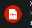

# Documentación UD1 Lenguajes de Marcas

## Introducción a Lenguajes de marcas

## Definición

Un lenguaje de marcsa organiza información mediante una sintaaxis basada en marcas o etiquetas

### Clasificación de Lenguaje de marcas

|Tipo|Uso|Ejemplos|
|---|---|---------|
|Presentación|Dar formato a documentos de texto|HTML, CSS|
|Intercambio de información|Almacenar información de forma ordenada|XML,RSS|
|Documentación|Documentar proyectos|Markdown, Wikitex,|

## Instalación y configuración del entorno

1. Insatalamos [VS Code](https://code.visualstudio.com/)        
2. Instalamos plugins 
   - [HTML CSS Support](https://marketplace.visualstudio.com/items?itemName=ecmel.vscode-html-css) 
   - [Live Preview](https://marketplace.visualstudio.com/items?itemName=ms-vscode.live-server)
   - [Markdown ALL In One](https://marketplace.visualstudio.com/items?itemName=yzhang.markdown-all-in-one)
   - [XML](https://marketplace.visualstudio.com/items?itemName=redhat.vscode-xml)
3. Instalamos git
```bash
sudo apt install git
```
4. Configurar repositorio git(en la carpeta principal del proyecto)
   
   
5. Conectar con github
```bash
git init
git add .
git commit -m"Comentario descriptivo"
```
  


 | Nombre | Desarrollador | Imagen| Funnción
|------|        -       |       -|  -   | 
|HTML CSS Support|Ecmel||Autocompleta clases e IDs de CSS dentro de tus archivos HTML para que no tengas que escribirlos de memoria.|
|Live Preview|Microsoft||Abre una pantalla dividida en el editor que muestra los cambios de tu código en tiempo real sin necesidad de recargar la página.
|Markdown All in One|Yu Zhang||Convierte el texto plano en una vista previa formateada con estilos (títulos, tablas, imágenes) y permite exportarlo a PDF o HTML.
|XML|Red Hat||Comprueba que la estructura del código XML sea correcta, auto-cierra etiquetas y organiza el texto de forma legible.


